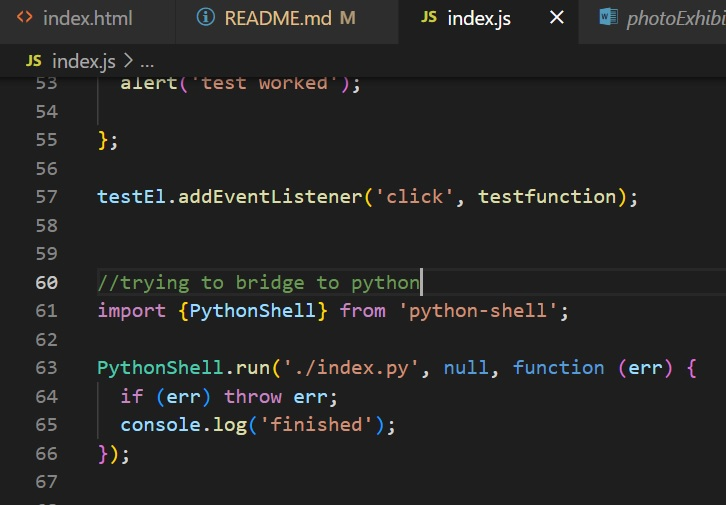
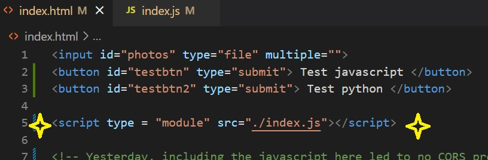

# Table of Contents

- [Purpose](#purpose)
- [Usage](#usage)
- [End_Goal](#endgoal)
- [Struggles](#struggles)
- [Attempts](#attempts)
- [Other_Struggles](#otherstruggles)

## Purpose

The purpose of this repo is to display two proof of concepts: 

1. Interacting with a website to upload photos. The photos are sent to a placeholder AI algorithm API call using javascript, and the classification of the photos are displayed on the webpage along with the confidence of the answer. 
2. Using a python script that uses docxtpl library to populate a word document template. 

## Usage 

To use this repo:

1. Open the index.html file in your browser. Select 'catTest.jpg', 'dogTest.jpg', 'dunnoTest.jpg' or any photos of cats or dogs on your computer to view the breed of the animal and the confidence of the answer.
2. Run the python script to create a word document and pdf (output in reports folder) that populated a template (photoExhibitionTemplate2.docx) with a table of photos (from ./images folder) and hard coded text. 

## End goal
The end goal is to seemlessly pass photos (either uploaded or eventually with [Egnyte API](https://developers.egnyte.com/docs) call) to a custom (to be built) AI algorithm on a similar API as this application uses (hugging faces), and use the results to generate a downloadable word document with the python script. 

## Struggles
1. Using javascript and python together
    - Passing the results of the huggingfaces AI API in index.html or index.js through the python script, index.js, to generate a word document. 

## Attempts

1. Using require python-shell in JS (preferred approach, open to other bridges)

However, 

<!-- !(error1) -->

2. Using flask (unfamiliar with it and python)
    - Struggle with initiating a virtual machine or whatever and not breaking everything/cascading errors

## Other Struggles
1. Getting Egnyte API to work (need to understand and establish call back url) 
2. Encountering CORS errors. 

